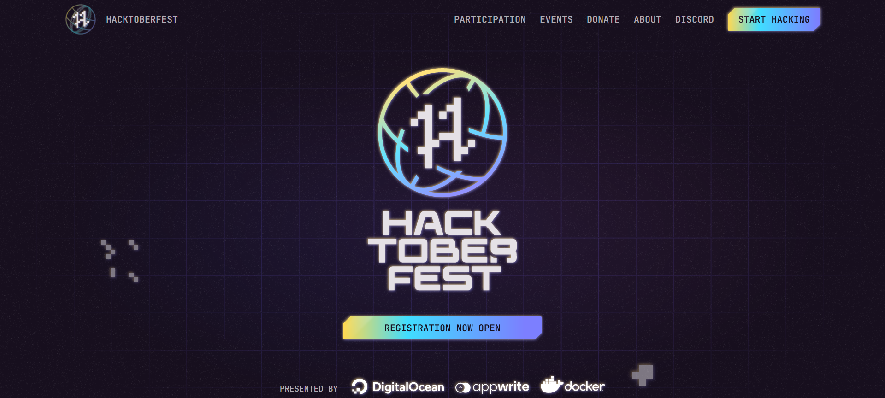

# Hacktoberfest 2022



Hacktoberfest is a month-long celebration of open source software run by DigitalOcean. During the month of October, we invite you to join open-source software enthusiasts, beginners, and the developer community by contributing to open-source projects. You can do this in a variety of ways:

- Prepare and share your project for collaboration
- Contribute to the betterment of a project via pull requests
- Organize an event
- Mentor others
- Donate directly to open source projects
# What can you contribute?
There is always something to contribute to a project whether you are a beginner or pro. In this project, you can add about interfacing different devices with microcontrollers/processors or maybe getting started with some electronic stuff. Or maybe you modify the documentation for same.

- For different controller/module create a different folder 
- Make sure to add circuit/connection diagram with your code
- Always first verify your code before making a Pull Request
- Add proper comments in the code
# How can you Contribute
To contribute in Hacktoberfest2022 follow the steps and checkout the link below:\
https://hacktoberfest.digitalocean.com 
## For making PR using github
- Fork this repository
- Make changes to forked repository 
- After confirming the changes contribute by making a pull request
- And wait for you Pull Request to be accepted
- That's It! Follow these steps and make your Pull Request (PR).
## For making PR your Local Machine
- You can get your own fork/copy of HacktoberFest-2022 by using the Fork button.
- Clone or (download) it on your local machine using:
  ```
  $ git clone https://github.com/Your_Username/Hacktoberfest-2022.git 
  ```
- Make Hacktoberfest-2022 as your current directory:
 ```
 $ cd Hacktoberfest-2022
 ```
- Create a new branch:
 ```
 $ git checkout BranchName
 ```
- Add files to your folder and then to push the changes follow:
```
$ git add .
$ git commit -m 'Message'
$ git push -u origin BranchName
```
- Go to your repository in the browser and click on compare and pull requests. Then add a title and description to your pull request.
# Eligibilty Criteria
- Same interfacing solution will not be accepted
- Star and fork the repository
- Must add your name and github username to Contributors.md after completing your task
## Contributors
<a href="https://github.com/electrongonewild/Hacktoberfest-2022/graphs/contributors">
  
</a>
